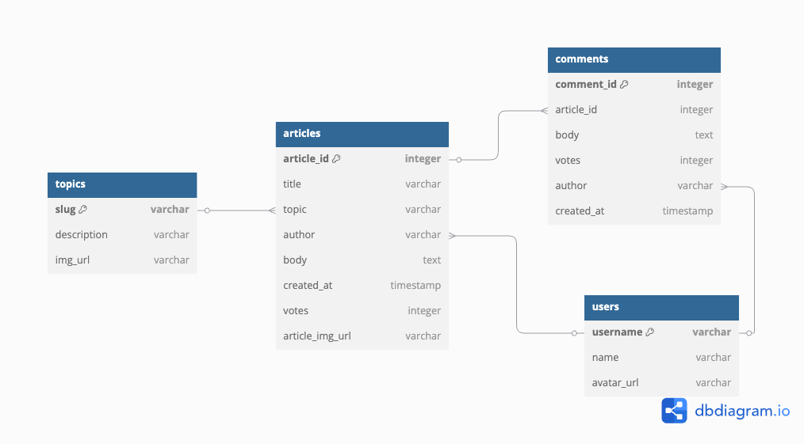
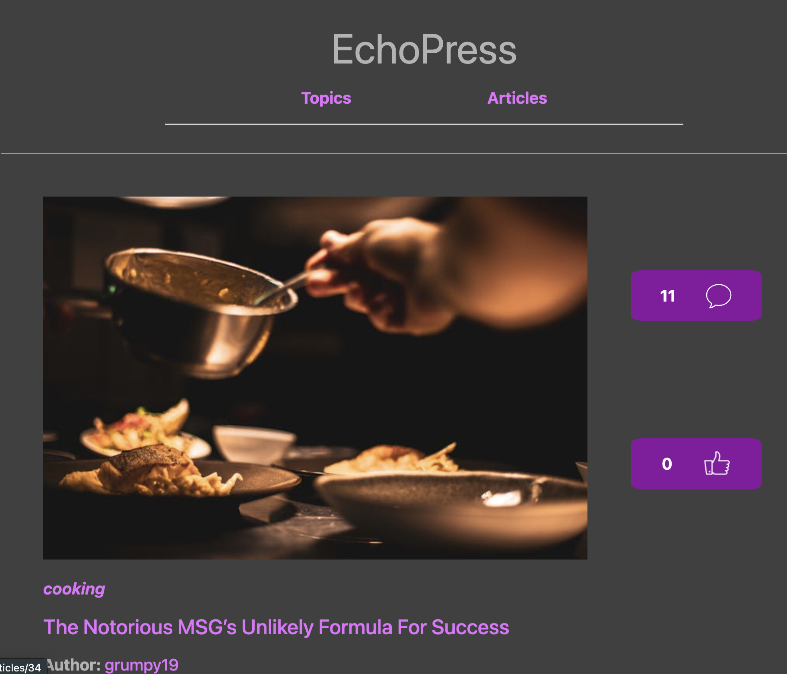
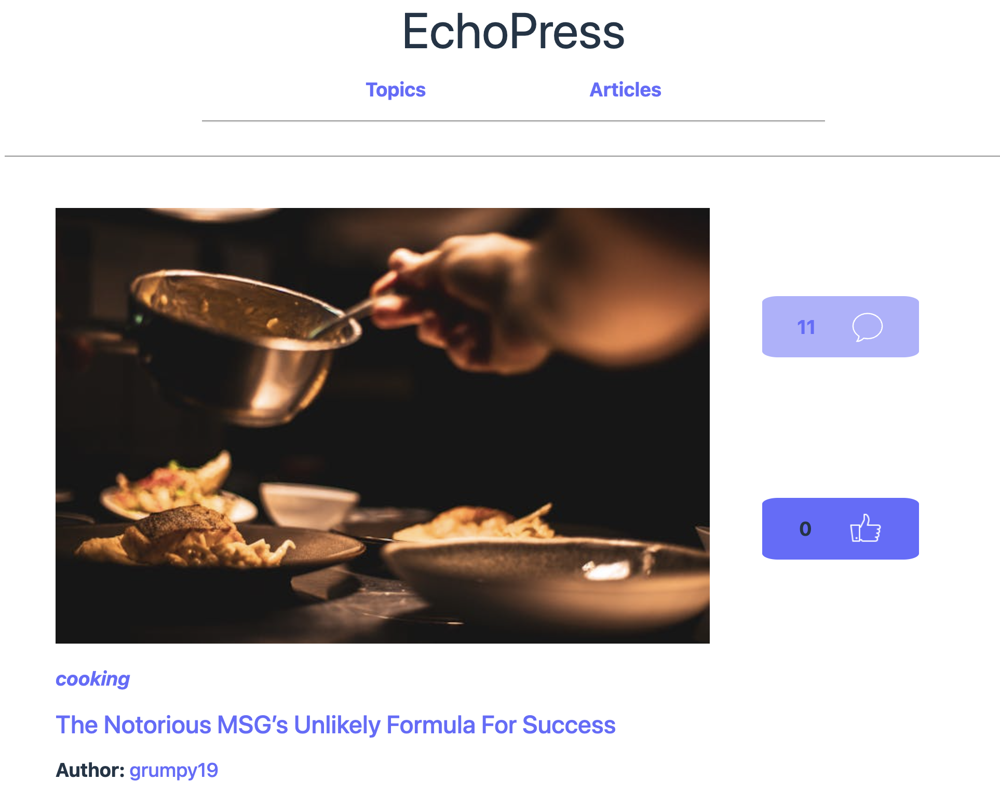
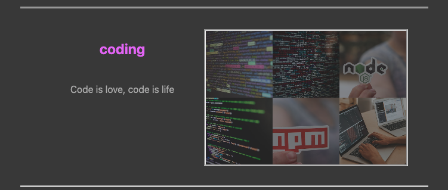
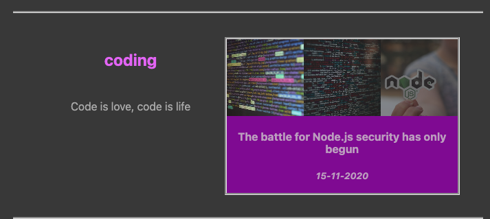

# 📰 EchoPress  
*A full-stack news discussion platform with article voting, commenting, and responsive design — powered by a custom backend and modern React frontend.*


## 🚀 Live Demo

🔗 [Frontend on Vercel](https://nc-news-fe-vercel.vercel.app/)  
🔗 [Backend API Repository](https://github.com/Max1357531/nc-news)

> 🕐 **Note**: The backend is hosted on [Render](https://render.com/), which may take ~60 seconds to spin up after inactivity. Please allow time for the backend to wake before interacting with the site.


## ✅ Key Features

- 🧾 **News Feed with Commenting & Voting**  
  Browse news articles, upvote them, and join the discussion with comments.

- 🔄 **Real-Time Updates**  
  Pages reflect user actions like voting and commenting without needing to refresh.

- 🌙 **Dark & Light Mode**  
  Seamlessly switch between themes with distinct styling and interaction cues.

- 📱 **Fully Responsive Design**  
  Optimized for desktop and mobile — hover interactions enhance usability.

- 🌐 **RESTful Backend API**  
  Articles, users, topics, and comments are served via a custom Express API.


## 🛠️ Tech Stack

### 🧩 Frontend

| React | Axios | JavaScript |
|-------|-------|------------|
|  |  |  |

### 🗄️ Backend

| Express.js | PostgreSQL | Jest | JavaScript |
|------------|------------|------|------------|
|  |  |  |  |


## 💡 Design Decisions

### 🗃️ Backend Architecture

The relational database contains four core tables:

- `users`
- `articles`
- `topics`
- `comments`

These are joined and queried via REST endpoints following standard HTTP conventions.




### 🎨 Color Scheme

Dark and light themes are designed with visual clarity in mind:

- **Link colors** differentiate navigation between pages.
- **Action colors** indicate interactivity (e.g., voting or commenting).

| Dark Mode | Light Mode |
|-----------|------------|
|  |  |


### 📱 Responsive Layout

Custom responsive views adapt based on screen size. On the **Topics** page, recent article thumbnails are displayed as a grid. Hovering reveals contextual information.

| Before Hover | On Hover |
|--------------|----------|
|  |  |


## 🧠 Coding Principles

- 🔁 **Component Reusability** — Built modular React components to minimize repetition and maximize readability
- 🗂️ **Separation of Concerns** — API interactions are isolated in service modules
- 🌐 **RESTful Architecture** — Follows predictable and consistent URL structure and HTTP methods
- ⚙️ **CI/CD Friendly** — Fully deployable via free hosting platforms (Render + Vercel)
- 🧪 **Test-Driven Backend** — All backend routes covered by unit and integration tests using Jest

---

## 🧪 Testing

The backend API is covered with:

- ✅ Unit Tests for individual controllers
- ✅ Integration Tests for route handling
- ✅ Error Handling Tests to catch bad requests

Tested using: **Jest**, **Supertest**

---

## 💻 How To Run
First clone the repo:
```
git clone https://github.com/Max1357531/nc-news-fe
```
Next, navigate to the repo and install dependencies:
```
cd nc-news-fe
npm install
```
To run the app locally:
```
npm run dev
```
Open http://localhost:3000 to view it in the browser
